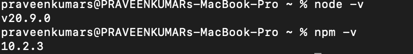
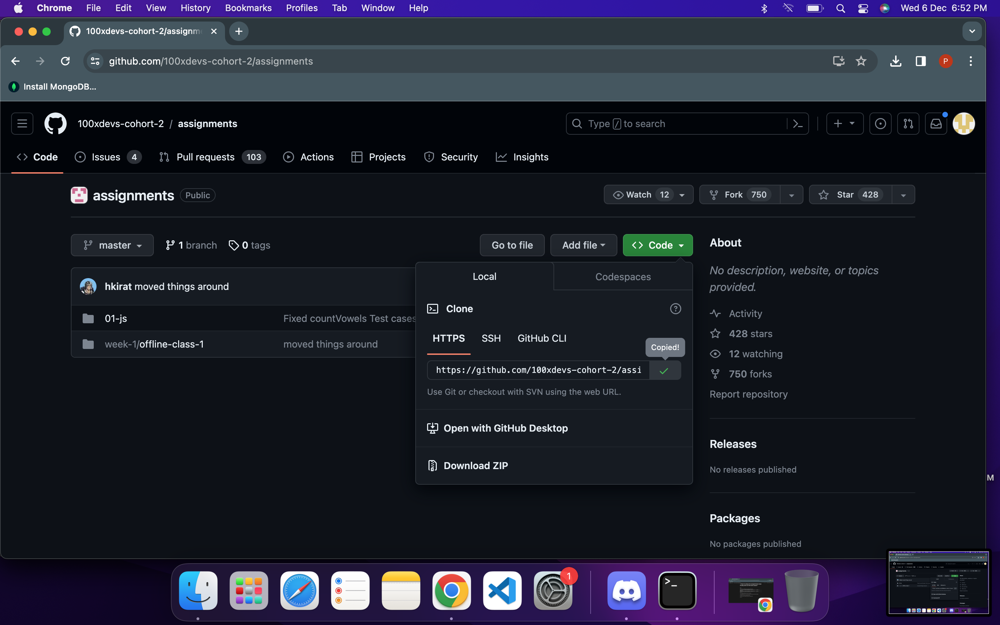
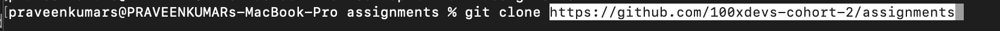
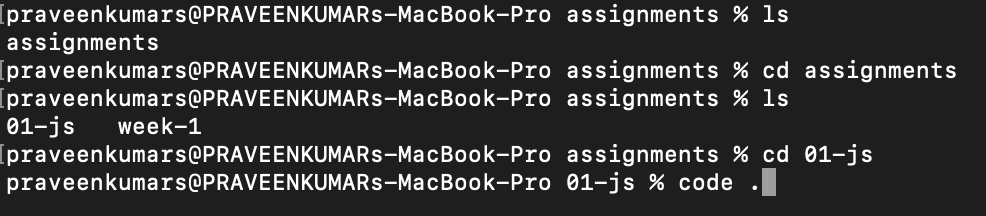
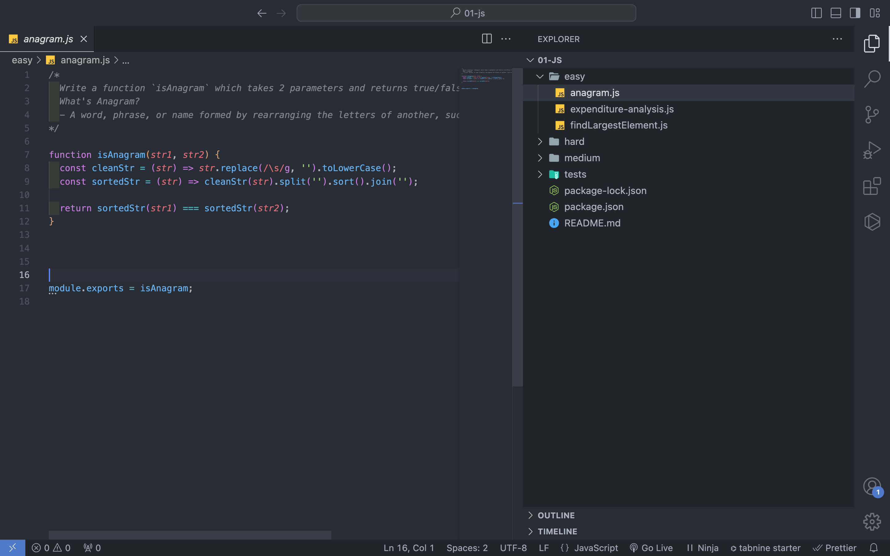
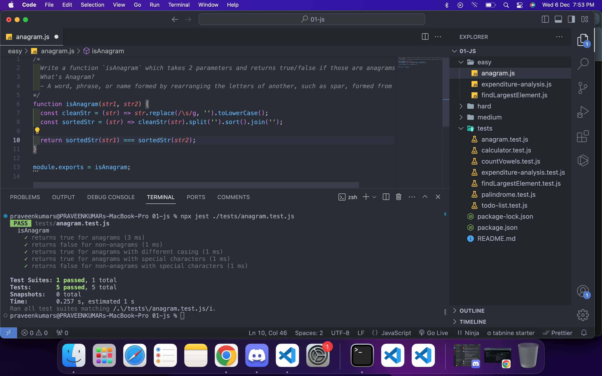

# Week 01

# How to setup the assignments repo locally and run the test cases?

**Steps**

1.Check node is available in your machine.using terminal!

```jsx
node -v -->to check the node version
```



2.If it is already installed go to step 4.if not.step 3

3.install nodejs from [download nodejs](https://nodejs.org/en) and setup it.refer youtube video if required.

4.install the vs code and complete the setup .

5.install and setup the git locally.refer youtube video. 

6.Go to [assignments repo](https://github.com/100xdevs-cohort-2/assignments) and copy the link.or download the .zip file and open it.



1. open the terminal and use the command 

```jsx
git clone githuburl
```



8 . do the following commands the file will open in the vs code or manually open it.

 



9 .Now vs code will be open 01-js file.Go to easy folder choose any problem .I choose anagram.js and solve it.



1. For running the test for particular problem.Open the terminal use the following command with your file name.

```jsx
npx jest ./tests/anagram.test.js
```



1. For running all the test case use the following command

```jsx
npx jest ./tests/
```

**SUCCESSFULLY COMPLETED**

*Note 

To run the test case should be in correct directory for this week it is 01-js

**IF ERROR OCCURS**

RUN THE FOLLOWING COMMANDS

```jsx
npm i -g
npm i npm -g
```

CHECK THE CURRENT DIRECTORY IT SHOULD BE 01-js

---

[Week-2](./Week-02.md)
