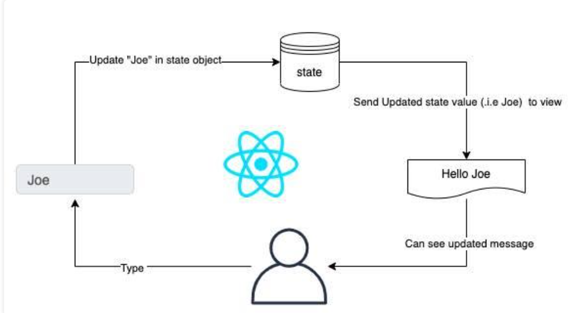

# Week 5.1

# React Foundations

In this lecture, Harkirat explores the essential `React Jargons`, focusing on `React Props`, their properties, and the concept of `destructuring props` for efficient pass-downs. It's worth noting that this session adopts a slower pace, revisiting topics covered previously. If you're already familiar with these concepts, `feel free to skip` ahead to more advanced material covered later in the lecture.

# Diving into React

As developers encountered challenges with traditional DOM manipulation, various libraries emerged to ease the process, with jQuery being one of them. However, even with such libraries, handling extensive applications remained complex. 

> Subsequently, Vue.js and React introduced a new syntax for front-end development. Behind the scenes, the React compiler transforms your code into HTML, CSS, and JavaScript, streamlining the development of large-scale applications.
> 

# Understanding DOMs

In React, there is a virtual DOM and a real DOM.

## 1] **Virtual DOM**

- React uses a virtual DOM to optimize updates and improve performance. The virtual DOM is an in-memory representation of the actual DOM elements. It's a lightweight copy of the real DOM.
- When you make changes to the state of a React component, React creates a new virtual DOM tree representing the updated state.
- React then compares the new virtual DOM with the previous virtual DOM to determine the differences (diffing).
- The differences are used to compute the most efficient way to update the real DOM.

## 2] **Real DOM**

- The real DOM is the actual browser's Document Object Model, representing the structure of the HTML document.
- When React determines the updates needed based on the virtual DOM diffing process, it updates the real DOM with only the necessary changes.
- Manipulating the real DOM can be expensive in terms of performance, so React aims to minimize direct interaction with it.

> In summary, while there are two representations—virtual DOM and real DOM—React abstracts the complexity of direct manipulation of the real DOM by using a virtual DOM and efficiently updating only the parts that have changed. This approach contributes to React's efficiency and performance in managing UI updates.
> 

# Some React Jargon

## 1] State

An object that represents the current state of the app. It represents the dynamic things in your app (things that change). For example, the value of the counter



## 2] Component

A React component is like a LEGO brick. Imagine you're building a spaceship with LEGO pieces. Each piece (component) has its own shape and color, and you can put them together to create the entire spaceship (user interface). 

Components in React work in a similar way – they're like building blocks that you can use to make cool things on the computer, like games or websites. Each piece (component) does its own special job, and you can use them over and over again to build different things.


## 3] Re-rendering

Imagine you have a digital pet on your computer. This pet can be happy or sad based on how it's feeling. In React, we represent this feeling with something called "state."

So, you have a button that, when clicked, changes your pet's feeling from happy to sad or vice versa. When you click the button, React notices that the state (the feeling of your pet) has changed. When the state changes, React is smart enough to say, "Oh, something's different now. Let's update what's shown on the screen to match the new feeling."

So, if your pet was happily dancing, clicking the button might make it change to a sad face. This updating process is what we call "re-rendering." It's like refreshing the screen to show the new state of your digital pet.

> In React, when the state changes, React automatically re-renders the component to reflect that change. This way, your users always see the most up-to-date and accurate information on the screen.
> 

# Simple Counter Application

Let’s start a new React project using Vite, you can follow these steps:

1. Open your terminal and run the following command to create a new Vite project:

```bash
npm create vite@latest
```

1. Follow the prompts to set up your project. You can choose the default settings for now.
2. Once the project is created, navigate to the project directory using:

```bash
cd your-project-name
```

1. Open the project in your code editor.

Now, let's build a simple **Let's create a simple Counter app in React to demonstrate re-rendering based on state changes**. Update the `src/App.jsx` file with the following code

```bash
import React, { useState } from 'react';
import './Counter.css'; // Assume you have a Counter.css file for styling

function Counter() {
  // Step 1: Define state using the useState hook
  const [count, setCount] = useState(0);

  // Step 2: Create functions to handle state changes
  const increment = () => {
    setCount(count + 1);
  };

  const decrement = () => {
    setCount(count - 1);
  };

  // Step 3: The component renders based on the state
  return (
    <div className="counter">
      <h1>Counter App</h1>
      <p>Count: {count}</p>
      <button onClick={increment}>Increment</button>
      <button onClick={decrement}>Decrement</button>
    </div>
  );
}

export default Counter;
```

1. **State Initialization:**
    
    ```jsx
    const [count, setCount] = useState(0);
    ```
    
    - We use the **`useState`** hook to create a state variable **`count`** initialized to 0.
    - **`setCount`** is a function we'll use to update the **`count`** state.

1. **State Change Functions:**
    
    ```jsx
    const increment = () => {
      setCount(count + 1);
    };
    
    const decrement = () => {
      setCount(count - 1);
    };
    ```
    
    - We create two functions (**`increment`** and **`decrement`**) that update the state when the buttons are clicked.
    
2. **Rendered UI Based on State:**
    
    ```jsx
    return (
      <div className="counter">
        <h1>Counter App</h1>
        <p>Count: {count}</p>
        <button onClick={increment}>Increment</button>
        <button onClick={decrement}>Decrement</button>
      </div>
    );
    ```
    
    The component returns JSX, representing the UI.
    
    - The UI shows the current count and two buttons for incrementing and decrementing the count.
    

> Now, when you click the "Increment" or "Decrement" button, the **`count`** state changes, triggering a re-render of the component. The UI is updated to reflect the new count value. This is the essence of re-rendering based on state changes in a React component.
> 

# React Props

In React, props (short for properties) are a way to pass data from a parent component to a child component. They allow you to customize and configure child components based on values provided by their parent components.


Here's a breakdown of key concepts related to React props:

## 1] **Passing Data:**

- Props enable the flow of data from a parent component to a child component.
- They are passed as attributes in JSX when rendering a child component.

## 2] **Functional Components:**

- In functional components, props are received as an argument to the function.

```jsx
function MyComponent(props) {
  // Access props here
}
```

## 3] **Class Components:**

- In class components, props are accessed using **`this.props`**.

```jsx
class MyComponent extends React.Component {
  render() {
    // Access props using this.props
  }
}
```

## 4] **Immutable and Read-Only**

- Props in React are read-only. A child component cannot modify the props it receives from a parent. Props are intended to be immutable.

## 5] **Customization and Reusability**

- Props allow you to customize the behavior and appearance of a component, making it versatile and reusable in different contexts.

## 6] **Default Values:**

- You can provide default values for props to ensure that the component works even if certain props are not explicitly passed.

## 7] **Destructuring Props:**

- You can use destructuring to extract specific props from the **`props`** object, making code cleaner.

```jsx
function MyComponent({ prop1, prop2 }) {
  // Access prop1 and prop2 directly
}
```

## 8] **Passing Functions as Props:**

- You can pass functions as props, allowing child components to communicate with their parent components.

Here's a simple example to illustrate the use of props:

```jsx

// ParentComponent.js
import React from 'react';
import ChildComponent from './ChildComponent';

function ParentComponent() {
  return <ChildComponent message="Hello from Parent!" />;
}

// ChildComponent.js
import React from 'react';

function ChildComponent(props) {
  return <p>{props.message}</p>;
}

export default ChildComponent;
```

In this example, **`ParentComponent`** passes the message "Hello from Parent!" to **`ChildComponent`** as a prop. The child component then displays this message. Props facilitate communication between components, making it easy to create modular and reusable React applications.


---

[Week-5.2](./Week-5.2.md)