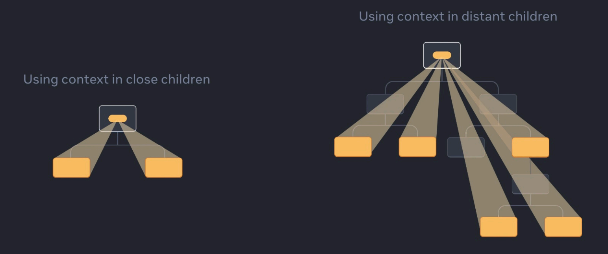

# Week 7.2

# Context API & Recoil

In this lecture, Harkirat covers the drawbacks of the Context API for state management and introduces Recoil as an alternative solution. The discussion focuses on Recoil's core elements, including `RecoilRoot`, `atoms`, `selectors`, and Recoil hooks. Through practical code examples, Harkirat demonstrates how Recoil simplifies state management in React, offering a robust and efficient approach.

# Statement Management

State management refers to the process of handling and maintaining the state or data of an application throughout its lifecycle. In frontend development, state typically represents the current condition or values of variables in an application. Effective state management is crucial for building dynamic and interactive user interfaces.

In React and other frontend frameworks, there are various methods to manage state:

1. **Local Component State:**
    - Each component in React can have its own local state managed using the `useState` hook.
    - Local state is confined to the component it belongs to and is primarily used for managing component-specific data.
2. **Context API:**
    - React provides the Context API to manage global state that needs to be accessed by multiple components.
    - It allows the sharing of state across the component tree without having to pass props manually through each level.
3. **State Management Libraries (e.g., Redux, Recoil):**
    - Specialized state management libraries offer advanced features for handling complex global state in large applications.
    - These libraries often introduce concepts like actions, reducers, and a centralized store for maintaining state.
4. **Recoil:**
    - Recoil is a state management library developed by Facebook specifically for React applications.
    - It introduces the concept of atoms and selectors, providing a more flexible and scalable approach to managing and sharing state.

> The choice of state management method depends on the complexity and requirements of the application. Effective state management enhances the predictability, maintainability, and scalability of the application, ensuring a smooth and responsive user experience.
> 



# Problem with Context API

Context API in React is a powerful tool for solving the prop drilling problem by allowing the passing of data through the component tree without the need for explicit props at every level. However, it does not inherently address the re-rendering issue.

When using the Context API, updates to the context can trigger re-renders of all components that consume that context, even if the specific data they need hasn't changed. This can potentially lead to unnecessary re-renders and impact the performance of the application.

To mitigate this, developers can use techniques such as memoization (with **`useMemo`** or **`React.memo`**) to prevent unnecessary re-renders of components that don't depend on the changes in context. Additionally, libraries like Redux, Recoil, or Zustand provide more fine-grained control over state updates and re-renders compared to the built-in Context API.

This leads us to Recoil, a state management library designed explicitly for React applications.

---

# Recoil

Recoil, developed by Facebook, is a state management library for React applications. It introduces a more sophisticated approach to handling state, offering features like atoms, selectors, and a global state tree. With Recoil, we can overcome some of the challenges associated with prop drilling and achieve a more scalable and organized state management solution. As we make this transition, we'll explore Recoil's unique features and understand how it enhances the efficiency and maintainability of our React applications.

# Concepts in Recoil

## 1] RecoilRoot

The `RecoilRoot` is a component provided by Recoil that serves as the root of the Recoil state tree. It must be placed at the top level of your React component tree to enable the use of Recoil atoms and selectors throughout your application.

Here's a simple code snippet demonstrating the usage of `RecoilRoot`:

```jsx
import React from 'react';
import { RecoilRoot } from 'recoil';
import App from './App';

const RootComponent = () => {
  return (
    <RecoilRoot>
      <App />
    </RecoilRoot>
  );
};

export default RootComponent;
```

In this example, `RecoilRoot` wraps the main `App` component, providing the context needed for Recoil to manage the state. By placing it at the top level, you ensure that all components within the `App` have access to Recoil's global state. This structure allows you to define and use Recoil atoms and selectors across different parts of your application.

## 2] atom

In Recoil, an atom is a unit of state. It represents a piece of state that can be read from and written to by various components in your React application. Atoms act as shared pieces of state that can be used across different parts of your component tree.

Here's a simple example of defining an atom:

```jsx
import { atom } from 'recoil';

export const countState = atom({
  key: 'countState', // unique ID (with respect to other atoms/selectors)
  default: 0,         // default value (aka initial value)
});
```

In this example, `countState` is an atom that represents a simple counter. The `key` is a unique identifier for the atom, and the `default` property sets the initial value of the atom.

> Once defined, you can use this atom in different components to read and update its value. Components that subscribe to the atom will automatically re-render when the atom's value changes, ensuring that your UI stays in sync with the state. This makes atoms a powerful and flexible tool for managing shared state in Recoil-based applications.
> 

# Recoil Hooks

In Recoil, the hooks `useRecoilState`, `useRecoilValue`, and `useSetRecoilState` are provided to interact with atoms and selectors.

## 1] **`useRecoilState`**:

- This hook returns a tuple containing the current value of the Recoil state and a function to set its new value.
- Example:
    
    ```jsx
    const [count, setCount] = useRecoilState(countState);
    ```
    

## 2] **`useRecoilValue`**:

- This hook retrieves and subscribes to the current value of a Recoil state.
- Example:
    
    ```jsx
    const count = useRecoilValue(countState);
    ```
    

## 3] **`useSetRecoilState`**:

- This hook returns a function that allows you to set the value of a Recoil state without subscribing to updates.
- Example:
    
    ```jsx
    const setCount = useSetRecoilState(countState);
    ```
    

These hooks provide a convenient way to work with Recoil states in functional components. `useRecoilState` is used when you need both the current value and a setter function, `useRecoilValue` when you only need the current value, and `useSetRecoilState` when you want to set the state without subscribing to updates. They contribute to making Recoil-based state management more ergonomic and straightforward.

# Selectors

In Recoil, selectors are functions that derive new pieces of state from existing ones. They allow you to compute derived state based on the values of atoms or other selectors. Selectors are an essential part of managing complex state logic in a Recoil application.

Here are some key concepts related to selectors:

## 1] **Creating a Selector:**

- You can create a selector using the `selector` function from Recoil.
- Example:
    
    ```jsx
    import { selector } from 'recoil';
    
    const doubledCountSelector = selector({
      key: 'doubledCount',
      get: ({ get }) => {
        const count = get(countState);
        return count * 2;
      },
    });
    ```
    

## 2] **Using Selectors in Components:**

- You can use selectors in your components using the `useRecoilValue` hook.
- Example:
    
    ```jsx
    import { useRecoilValue } from 'recoil';
    
    const DoubledCountComponent = () => {
      const doubledCount = useRecoilValue(doubledCountSelector);
    
      return <div>Doubled Count: {doubledCount}</div>;
    };
    ```
    

## 3] **Atom and Selector Composition:**

- Selectors can depend on atoms or other selectors, allowing you to compose more complex state logic.
- Example:
    
    ```jsx
    const totalSelector = selector({
      key: 'total',
      get: ({ get }) => {
        const count = get(countState);
        const doubledCount = get(doubledCountSelector);
        return count + doubledCount;
      },
    });
    ```
    

> Selectors provide a powerful way to manage derived state in a Recoil application, making it easy to compute and consume state values based on the current state of your atoms.
> 

# Recoil Code Implementation

To create a Recoil-powered React application with the described functionality, follow the steps below:

1. Install Recoil in your project:

```bash
npm install recoil
```

1. Set up your project structure:

Assuming a folder structure like this:

```
/src
  /components
    Counter.jsx
  /store/atoms
    countState.jsx
  App.jsx
```

1. Create `countState.js` in the `atoms` folder:

```jsx
// store/atoms/countState.jsx
import { atom } from 'recoil';

export const countState = atom({
  key: 'countState',
  default: 0,
});
```

1. Create `Counter.js` in the `components` folder:

```jsx
// components/Counter.jsx
import React from 'react';
import { useRecoilState, useRecoilValue } from 'recoil';
import { countState } from '../store/atoms/countState';

const Counter = () => {
  const [count, setCount] = useRecoilState(countState);

  const handleIncrease = () => {
    setCount(count + 1);
  };

  const handleDecrease = () => {
    setCount(count - 1);
  };

  const isEven = useRecoilValue(countIsEven);

  return (
    <div>
      <h1>Count: {count}</h1>
      <button onClick={handleIncrease}>Increase</button>
      <button onClick={handleDecrease}>Decrease</button>
      {isEven && <p>It is EVEN</p>}
    </div>
  );
};

export default Counter;
```

1. Create `App.js`:

```jsx
// App.jsx
import React from 'react';
import { RecoilRoot } from 'recoil';
import Counter from './components/Counter';

function App() {
  return (
    <RecoilRoot>
      <Counter />
    </RecoilRoot>
  );
}

export default App;
```

Make sure to adjust your project's entry point to use `App.js`.

Now, your Recoil-powered React application should render a counter with increase and decrease buttons. The message "It is EVEN" will be displayed when the count is an even number.